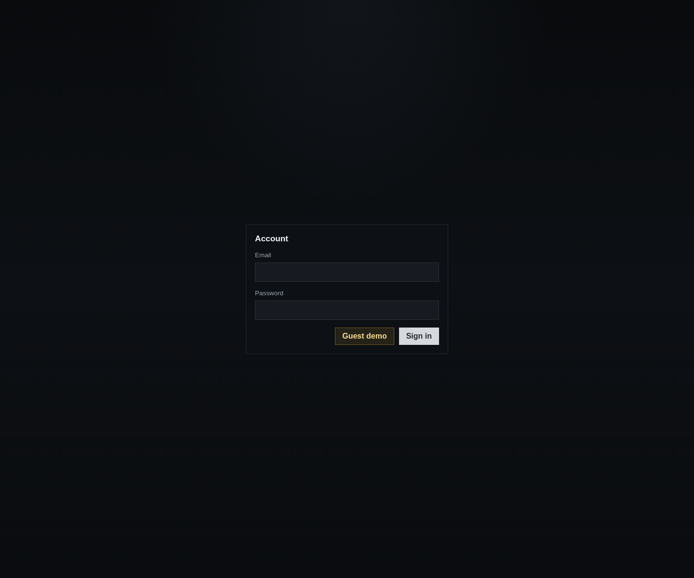
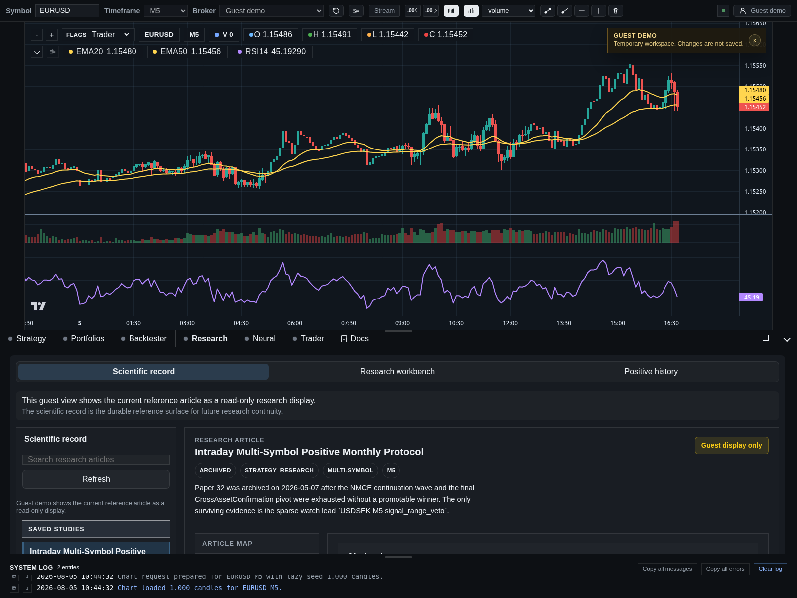

# Robotineeko

Public source snapshot of a live quantitative trading workbench built and maintained as a real product.

Live product: `https://robotineeko.com.br`

## What recruiters should see here

- A real React + Vite frontend with large authenticated product surfaces.
- A real FastAPI backend with auth, docs, workspace, chart, strategy, and neural-related flows.
- Product thinking beyond CRUD: research workflow, backtesting, broker-aware behavior, and runtime monitoring.
- Evidence of shipping and maintenance, not just isolated toy scripts.

## Product scope

Robotineeko is a broker-aware workbench that connects:

- strategy authoring
- backtesting
- results inspection
- comparative research
- neural experimentation
- trader runtime monitoring
- curated in-product documentation

The live product also includes a guest-safe showcase mode for review and demonstration.

## Public product snapshots

Landing surface with a safe public entry point:



Guest demo research console with real charting and read-only workflow review:



## Tech stack

- React 19
- Vite 8
- FastAPI
- Python
- lightweight-charts
- SQLite-backed application state in the private runtime
- MT5 bridge integration in the live system

## Repository layout

```text
frontend/
  src/
  public/
  shared/
backend/
  python/
  requirements.txt
docs/
```

## What is included

- Real frontend application code from the production codebase, curated for public review.
- Real backend application code from the production codebase, curated for public review.
- Public-safe product documentation used to explain the workflow and architecture.
- Tests that show guest hardening and backend behavior.

## What is intentionally not included

- user-created data
- private databases or snapshots
- environment files and secrets
- deployment server configs
- runtime logs and operational artifacts
- the private `/fund` data-room surface
- internal research catalogs and other operational outputs

This repository is meant to show how the product is built, not to mirror the live environment byte-for-byte.

## Quick tour

- [docs/README.md](./docs/README.md)
- [frontend/README.md](./frontend/README.md)
- [backend/README.md](./backend/README.md)

## Why this repo is curated

The production repository contains live operational material that should not be public. This snapshot keeps the engineering signal high while removing secrets, private data, runtime state, and restricted business surfaces.
